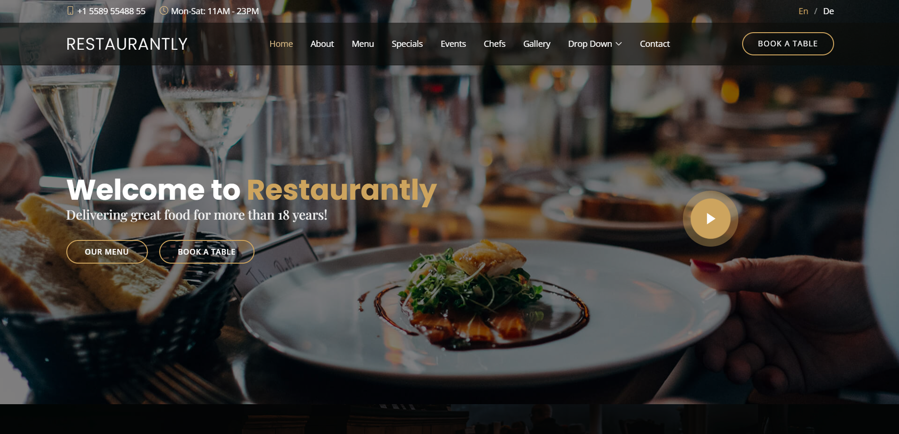

# 🚀 Restaurantly - Modern Restaurant Website

> *🌐 Lien du site en direct :* [Cliquez ici pour voir le site](https://abdennour-tech.github.io/Restaurantly---Modern-Restaurant-Website/)

### 📸 Aperçu du projet

Ceci est un projet de site web moderne pour un restaurant, réalisé avec une interface responsive et un système de réservation.

## 🌟 Fonctionnalités
- *Interface Responsive :* S'adapte parfaitement aux mobiles, tablettes et ordinateurs.
- *Système de Réservation :* Formulaire intégré pour la réservation de tables.
- *Menu Dynamique :* Présentation claire des plats avec filtrage.
- *Galerie Photo :* Affichage des photos du restaurant.
- *Formulaire de Contact :* Système fonctionnel (Frontend).

## 🛠️ Technologies Utilisées
- *Front-end :* HTML5, CSS3, JavaScript, Bootstrap.
- *Back-end :* PHP (Scripts de gestion).
- *Design :* Google Fonts, Font Awesome.

## 📁 Structure du Projet
- index.html : Page principale du site.
- /assets : Fichiers CSS, JS et images.
- /forms : Scripts PHP pour la réservation et le contact.

## 👤 Auteur
*Badereddine Abdennour*
- [LinkedIn](https://www.linkedin.com/in/badreddine-abdennour-2844652a5)
- [GitHub](https://github.com/Abdennour-Tech)
